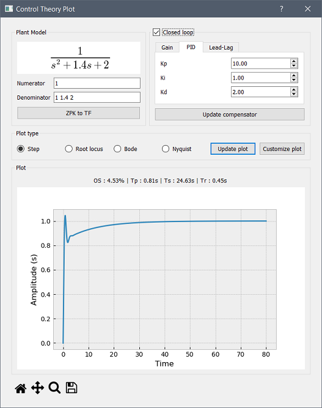

# control-theory-plot
## About

A simple PyQt interface for plotting common graphs in control theory.

The transfer function can be set either in the numerator/denominator form or in the zeros/poles/gain form.

The closed loop can be compensated through a simple gain, a PID or a Lead-Lag compensator.

## Prerequisites

```
pip install numpy matplotlib scipy python-control pyqt5
```

## Screenshot

